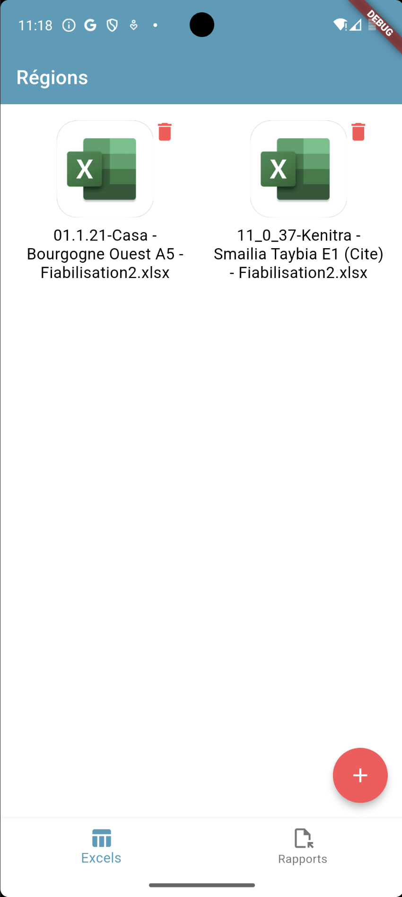
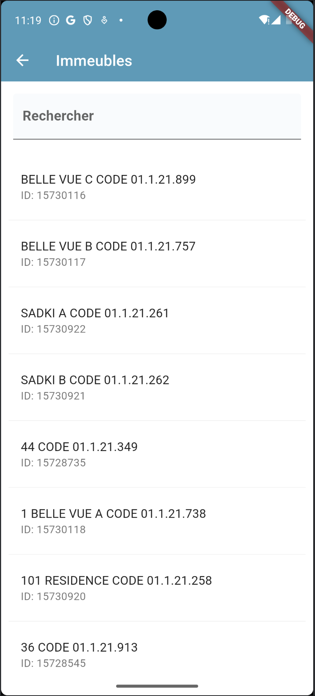
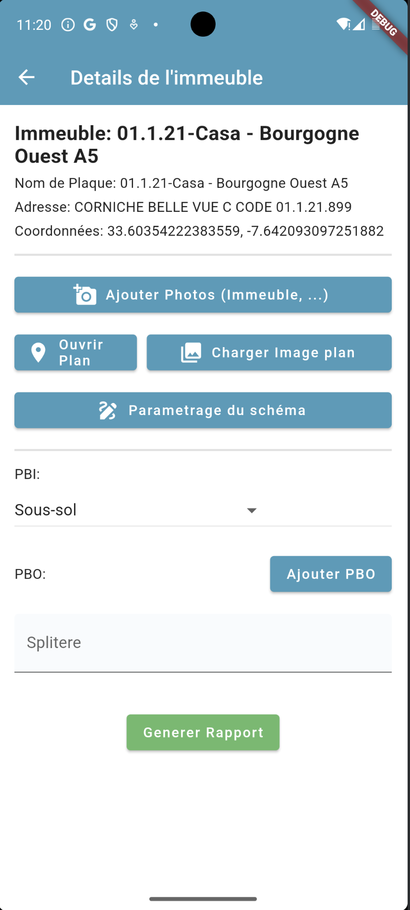
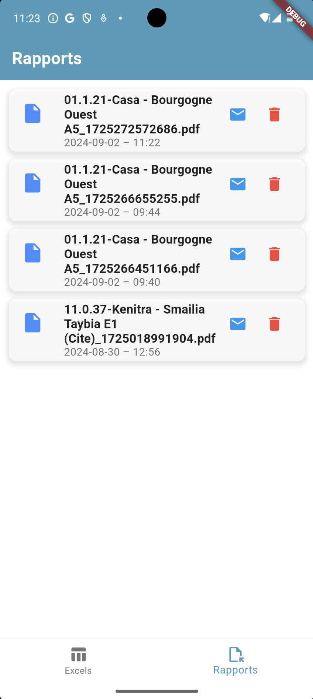

# camusat_report

## Introduction

This project is part of an internship at **Camusat Telcam**, designed to create a mobile application for managing and documenting site inspections. The app allows users to gather technical data, upload photos, and generate comprehensive reports to improve project oversight and auditing processes.

## Purpose

The goal of the app is to provide a robust and user-friendly tool for field technicians to document site inspections efficiently. It supports real-time data entry, file management, and report generation, ensuring seamless workflow integration for site inspections.

## Key Features

- **Data Entry & Management**: Allows users to input detailed building information, including geographical data, equipment status, and more.
- **Photo Capture & Upload**: Users can take site photos or upload existing images directly into the app, associating them with building data.
- **Report Generation**: Automatically compiles collected data into structured PDF reports.
- **Persistent Local Storage**: Saves data locally to ensure work continuity even when offline.
- **Search & List**: Quickly find and review building inspections using search filters.

## Development Environment

- **Framework**: Flutter
- **Language**: Dart
- **Platforms**: iOS & Android
- **IDE**: IntelliJ IDEA
- **Version Control**: GitHub

## Key Screenshots

1. **Main Page**  
   The entry point where users can access different app functionalities, such as loading files or reviewing buildings.  
   

2. **Load Files Page**  
   A dedicated page for loading and managing inspection files, including images and PDF documents.  
   

3. **List and Search Page**  
   This page allows users to list buildings and search by various criteria, such as name or region.  
   

4. **Building Details Page**  
   Displays detailed information about a specific building, including data fields and associated photos.  
   

5. **Reports List Page**  
   Users can access a list of generated reports here, review, and download PDFs for their records.  
   

## Results and Learnings

During the development of the Camusat Site Inspection App, we achieved several key outcomes:

1. **Improved Operational Efficiency**: The app has streamlined data collection and reporting, reducing the time spent on manual documentation.
2. **Enhanced Traceability**: With structured input forms and photo documentation, every site visit is fully traceable, providing a reliable history of inspections.
3. **Real-Time Reporting**: The automated PDF generation ensures that all necessary data is compiled into a professional report in real-time.
4. **User Satisfaction**: The intuitive UI has been positively received by field technicians, improving overall productivity and data accuracy.

## Technologies Used

- **Dart & Flutter**: Cross-platform development framework used for creating the app.
- **GitHub**: For version control and project management.
